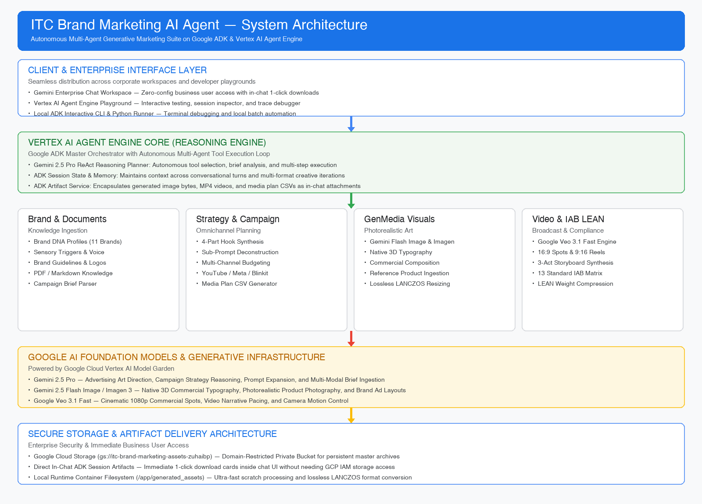
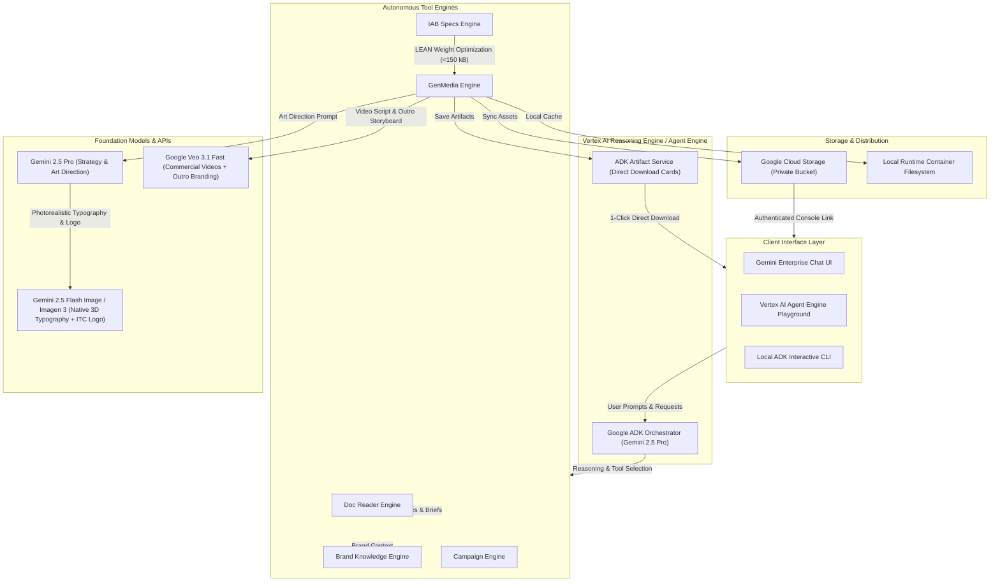

# 🍪 ITC Brand Marketing AI Agent

An autonomous, multi-modal generative marketing suite engineered for **ITC Limited** on the **Google Agent Development Kit (ADK)** and deployed directly to **Google Cloud Vertex AI Agent Engine (Reasoning Engine)** for **Gemini Enterprise**.

---

## 🌟 Executive Summary

The **ITC Brand Marketing AI Agent** empowers brand managers, creative directors, and media planners to plan, generate, resize, and validate omnichannel marketing assets across ITC’s complete brand portfolio (*Sunfeast Dark Fantasy, Bingo!, Fiama, Aashirvaad, Savlon, Engage, B Natural, Sunfeast Yippee!, Classmate, ITC Hotels, Fabelle*).

### 🚀 Key Capabilities:
- **🎨 Photorealistic Display Advertising**: Generates native in-image 3D commercial typography and brand taglines with zero artificial digital overlays.
- **🏷️ Consistent Official ITC Logo Branding**: Automatically incorporates the official ITC logo brandmark and endorsement badge in **both generated images and video commercials**.
- **📐 100% IAB LEAN Compliance**: Automatically validates and optimizes file weight (under 150 KB) and aspect ratios across all 13 standard IAB banner units (300x250, 728x90, 300x600, 970x250, etc.) with lossless LANCZOS scaling.
- **🎬 Cinematic Video Commercials (Google Veo)**: Produces broadcast-ready 16:9 in-stream commercial spots (6s) and 9:16 vertical reels (10s) with 3-act storyboards.
- **🎯 Creative Hook & Strategy Synthesis**: Reads brand guidelines/briefs from `ITC Marketing Files/` or synthesizes 4-part sub-prompts (Hero, Background, Headline, CTA).
- **📊 Omnichannel Media Planning**: Computes multi-channel budget allocations across YouTube, Meta, GDN, and Quick-Commerce (Blinkit/Zepto) with automated CSV exports.
- **🔒 100% Account-Agnostic & 1-Click Provisioning**: Self-bootstrapping scripts that auto-create virtual environments, enable GCP APIs, provision Service Accounts, bind IAM roles, and configure Cloud Storage buckets dynamically.

---

## 🏗️ System Architecture





---

## ⚡ 1-Click Zero-Friction Setup (Customer Ready)

Everything needed to install dependencies, configure environment variables, provision GCP APIs, and configure IAM permissions is packaged into automated, self-bootstrapping scripts.

### Step 1: Clone & Run Setup
```bash
# Navigate to project folder
cd itc_brand_marketing_agent

# Run the 1-click setup script
./setup.sh
```

**What `./setup.sh` does automatically:**
1. ✅ Detects Python 3.10+ and provisions a local isolated `venv`.
2. ✅ Installs and verifies all dependencies from `requirements.txt`.
3. ✅ Generates `.env` and automatically detects your active GCP Project ID.
4. ✅ Enables Vertex AI & Cloud Storage APIs (`aiplatform.googleapis.com`, `storage.googleapis.com`).
5. ✅ Provisions a dedicated Service Account (`itc-marketing-agent-sa`) and binds required IAM roles (`roles/aiplatform.user`, `roles/storage.objectAdmin`).
6. ✅ Creates a dedicated private Cloud Storage bucket (`gs://itc-brand-marketing-assets-[project_id]`).

---

## 🚀 Running & Deploying the Agent

### 1. Interactive CLI Mode
```bash
./run.sh
```
*Provides an interactive console to generate full campaigns, replicate master art across all 13 IAB sizes, or browse ITC brand profiles.*

### 2. ADK Visual Web UI Mode
```bash
./web.sh 8080
```
*Launches the Google ADK Agent Designer web interface at `http://127.0.0.1:8080`.*

### 3. Deploy to Google Cloud Vertex AI Agent Engine
```bash
./deploy.sh
```
*Deploys the high-code multi-agent directly to Google Vertex AI Reasoning Engine / Agent Engine in `us-central1` and provides your Gemini Enterprise Playground URL.*

---

## 🔐 Dual Authentication Options

The agent automatically adapts to whichever authentication method is present:

| Authentication Method | How It Works | Ideal For |
|---|---|---|
| **Google Cloud ADC (Vertex AI)** | Uses active `gcloud auth application-default login` or Service Account credentials. | Enterprise deployment, Vertex AI Agent Engine, Cloud Storage. |
| **Google AI Studio API Key** | Set `export GEMINI_API_KEY="your-key"` in `.env`. | Quick standalone development without GCP project configuration. |

---

## 🛠️ Tool Suite Specifications

| Tool Name | Engine | Functionality |
|---|---|---|
| `generate_marketing_image` | GenMedia | Generates photorealistic IAB ads with native 3D typography, official ITC logo branding, and IAB LEAN compression (<150 KB). |
| `generate_marketing_video` | GenMedia / Veo | Produces 16:9 (6s) commercial spots or 9:16 (10s) reels with 3-act storyboards and ITC outro branding. |
| `resize_image_to_iab_format` | GenMedia / PIL | Adapts existing master art to any IAB dimension using lossless LANCZOS scaling without stretching. |
| `optimize_image_for_iab_compliance`| IAB Specs | Compresses any high-res banner to guarantee strict IAB LEAN payload limits (<150 KB, 1px border). |
| `replicate_master_to_all_iab_formats`| GenMedia | Replicates master art across all 13 standard IAB ad units in a single invocation. |
| `check_or_create_creative_hooks` | Campaign | Ingests or synthesizes brand hooks (Pattern Interrupt, Hook, Benefit, CTA). |
| `check_or_create_media_plan` | Campaign | Allocates campaign budget across YouTube, Meta, GDN, and Quick-Commerce with CSV export. |
| `build_full_itc_campaign` | Campaign | End-to-end orchestrator: brief + hooks + multi-size banners + video ad + budget CSV. |

---

## 📐 IAB Display Ad Formats Supported (13 Standard Units)

| IAB Unit Name | Dimensions (px) | Aspect Ratio | Max Initial Load | Key Placement |
|---|---|---|---|---|
| **Medium Rectangle** | 300x250 | 1.2:1 (6:5) | 150 KB | Desktop & Mobile Universal Standard |
| **Leaderboard** | 728x90 | 8.09:1 | 150 KB | Desktop Top Header |
| **Half Page / Skyscraper** | 300x600 | 1:2 (9:16) | 200 KB | Brand Storytelling & Rich Media |
| **Billboard** | 970x250 | 3.88:1 | 250 KB | Desktop Hero Placement |
| **Large Rectangle** | 336x280 | 1.2:1 | 150 KB | High-Impact Editorial Placements |
| **Wide Skyscraper** | 160x600 | 1:3.75 | 150 KB | Desktop Sidebar Navigation |
| **Skyscraper** | 120x600 | 1:5 | 150 KB | Narrow Sidebar |
| **Square** | 250x250 | 1:1 | 150 KB | Compact In-Feed |
| **Small Rectangle** | 180x150 | 1.2:1 | 150 KB | Grid Placement |
| **Square Button** | 125x125 | 1:1 | 150 KB | Button / Badge |
| **Vertical Banner** | 120x240 | 1:2 | 150 KB | Compact Vertical Placement |
| **Full Banner** | 468x60 | 7.8:1 | 150 KB | Secondary Header |
| **Half Banner** | 234x60 | 3.9:1 | 150 KB | Column Separator |

---

## 🌟 Customer Prompt Gallery

### 1. Photorealistic IAB Display Ad with Native Typography & Logo
> *"Generate a 300x250 Medium Rectangle commercial ad for Sunfeast Dark Fantasy. Create a photorealistic composition with the cookie splitting open to reveal a molten chocolate core, surrounded by gold dust. Render the headline 'Pure Choco Indulgence' natively into the artwork in 3D gold typography, and include the official ITC logo brandmark."*

### 2. Multi-Size IAB Adaptation (13 Sizes)
> *"Create a master creative concept for Fiama Gel Bar featuring refreshing dew drops and aquatic micro-bubbles with the headline 'Mood Uplift Shower'. Replicate and optimize this creative across all 13 standard IAB display banner formats."*

### 3. Cinematic Commercial Video (Google Veo)
> *"Generate a 16:9 cinematic commercial video ad for Sunfeast Dark Fantasy Choco Fills showcasing the cookie breaking open in slow motion with molten chocolate flowing out, closing with the official ITC corporate brand outro."*

### 4. Full Omnichannel Campaign Plan
> *"Build a complete ₹50 Lakhs festive campaign for Aashirvaad Sharbati Atta under the theme 'festive_diwali', including campaign brief, creative hooks, top IAB banners, a video ad, and a multi-channel media budget CSV export."*

---

## 🧪 Automated Testing

Run the complete 9-test unit and integration suite:
```bash
./venv/bin/pytest test_agent.py -v
```

---

## 📄 License & Standards Compliance

- **Framework**: Google Agent Development Kit (ADK)
- **Deployment Platform**: Google Cloud Vertex AI Reasoning Engine / Gemini Enterprise
- **Compliance Standard**: Interactive Advertising Bureau (IAB) Standard Ad Unit Portfolio & LEAN Specifications
