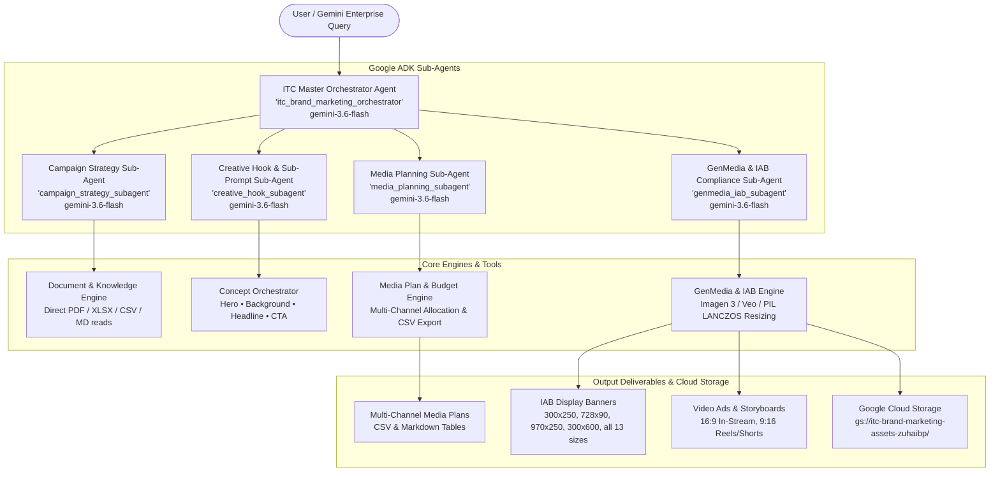

# ITC Brand Marketing AI Agent — Powered by Google ADK

An autonomous, high-code multi-agent marketing suite built natively with the **Google Agent Development Kit (ADK)** for **Gemini Enterprise / Vertex AI Agent Engine**. Designed specifically for **ITC Limited**, this agent inspects marketing documents (PDFs, spreadsheets, CSVs, brand guidelines) directly without requiring vector embeddings, synthesizes brand hooks, creative angles, audience segmentation, and multi-channel media plans, and generates **IAB-compliant display banners (Google Imagen 3 / Gemini Flash Image)** and **cinematic video advertisements (Google Veo)**.

---

## 🏗️ Architecture & Multi-Agent System



---

## 🌟 ITC Brand Coverage

The agent contains deep domain knowledge, color palette rules, sensory triggers, taglines, and historical marketing benchmarks for 11 flagship ITC brands:

| Brand | Category | Key Products & Hero USPs | Primary Color Palette | Signature Aesthetic |
| :--- | :--- | :--- | :--- | :--- |
| **Sunfeast Dark Fantasy** | Foods (Indulgent Biscuits) | Choco Fills, Coffee Fills, Bourbon, Desserts | Dark Cacao (`#2A1810`), Molten Gold (`#D4AF37`) | Cinematic chiaroscuro, slow-mo molten chocolate core break |
| **Aashirvaad** | Foods (Staples & Organic) | Chakki Atta, Select Sharbati, Organic Dals, Ghee | Golden Wheat (`#E5A93C`), Emerald Green (`#2E7D32`) | Sun-drenched harvest fields, soft steaming puffed rotis |
| **Bingo!** | Foods (Snacks & Chips) | Mad Angles, Tedhe Medhe, Hashtags, Potato Chips | Electric Yellow (`#FFD700`), Fire Red (`#E60000`) | High-energy pop art, explosive spice powder blast |
| **Sunfeast Yippee!** | Foods (Noodles & Pasta) | Magic Masala, Mood Masala, Power Up Atta | Sunshine Orange (`#FF6B00`), Tomato Red (`#E50914`) | Swirling fork twirl lifting non-sticky steaming noodles |
| **B Natural** | Foods (Juices & Beverages) | 100% Pomegranate, Himalayan Apple, Mango | Orchard Green (`#388E3C`), Mango Gold (`#FFB300`) | Dew-kissed fruit slices, splashing 0% concentrate nectar |
| **Fiama** | Personal Care (Shower Gels) | Blackcurrant Shower Gel, Gel Bathing Bars | Aqua Cyan (`#00B4D8`), Berry Violet (`#7209B7`) | Translucent jewel gels, micro-bubbles, aromatherapy spa |
| **Savlon** | Personal Care (Hygiene) | Antiseptic Liquid, Moisture Shield Handwash | Medical Blue (`#005696`), Healing Orange (`#FF8C00`) | No-sting gentle healing, 99.99% germ shield hologram |
| **Engage** | Personal Care (Fragrance) | Pocket Perfumes, Cologne Sprays, Deodorants | Midnight Navy (`#1A1A2E`), Crimson (`#E94560`) | Sleek pocket card sprays, neon nightlife romantic mist |
| **Fabelle** | Foods (Ultra-Luxury Chocolates) | Gianduja, Single Origin Cacao, Elements Pralines | Obsidian Black (`#0D0D0D`), Matte Gold (`#C5A059`) | 24k gold leaf on ganache spheres, haute chocolaterie |
| **ITC Hotels** | Hospitality (Luxury & Dining) | Grand Chola, Maurya, Royal Bengal, Bukhara | Royal Crimson (`#8B0000`), Gold (`#DAA520`) | Palatial Indian architecture, Dal Bukhara charcoal aroma |
| **Classmate** | Education & Stationery | Pulse Notebooks, Interaktiv, Octane Pens | Smart Teal (`#00A896`), Deep Cyan (`#028090`) | Ultra-smooth chlorine-free paper, frictionless pen glide |

---

## 📁 Direct Document Inspection (No Embeddings)

Instead of complex vector databases or embeddings, the agent reads and writes directly into the filesystem under `ITC Marketing/ITC Marketing Files/`:
- **`Campaign Hooks/`**: Strategy briefs (PDF/Markdown) outlining target personas and value propositions.
- **`Creative Hooks/`**: High-energy audio hooks, visual scroll-stoppers, and 4-part sub-prompts.
- **`Media Plan/`**: Multi-channel media budgets and channel mix.
- **`Audience/`**: Detailed demographic and psychographic customer segments (`itc_customer_segments_demo.xlsx`).
- **`Historical campaign and channel performance/`**: Real analytics CTR, VTR, and ROAS benchmarks (`itc_campaign_analytics_demo.csv`).
- **`Brand Guidelines/`**: Corporate brand guidelines 2026 (`itc_limited_brand_guidelines_2026.md`) and official logo assets (`ITC.png`).

**Dynamic Check-or-Create Workflow**: If a requested brand document is not present, the agent automatically synthesizes a professional document adhering to ITC brand standards and saves it into the folder for future use.

---

## 📐 IAB New Ad Portfolio & LEAN Compliance Specifications

The agent strictly enforces all official IAB display and video ad requirements:

| IAB Ad Unit | Dimension (px) | Aspect Ratio | Max Initial Load | Max Subload | Imagen / Veo Ratio | Channel Placement |
| :--- | :--- | :--- | :--- | :--- | :--- | :--- |
| **Medium Rectangle (MPU)** | 300x250 | 1:1 | 150 kB | 300 kB | `1:1` | GDN, Mobile & Desktop In-Feed |
| **Leaderboard** | 728x90 | 8:1 | 150 kB | 300 kB | `16:9` | Desktop Header / Above-the-Fold |
| **Billboard** | 970x250 | 4:1 | 250 kB | 500 kB | `16:9` | Premium Masthead Takeovers |
| **Half Page / Filmstrip** | 300x600 | 1:2 | 200 kB | 400 kB | `9:16` | High-Impact Desktop Right Rail |
| **Super Leaderboard** | 970x90 | 10:1 | 200 kB | 400 kB | `16:9` | Pushdown / Expandable Units |
| **Skyscraper** | 160x600 | 1:4 | 150 kB | 300 kB | `9:16` | Side Gutters & News Portals |
| **Large Rectangle** | 336x280 | 1:1 | 150 kB | 300 kB | `1:1` | In-Article High-CTR Units |
| **Smartphone Banner** | 320x50 | 6:1 | 50 kB | 100 kB | `16:9` | Mobile Web Sticky Bottom |
| **Mobile Interstitial** | 1080x1920 | 9:16 | 300 kB | 600 kB | `9:16` | Instagram Reels & YouTube Shorts |
| **In-Stream Video Ad** | 1920x1080 | 16:9 | 300 kB | 600 kB | `16:9` | YouTube Bumper (6s) & Non-Skip |

---

## 🎨 Generative Media Engines

### 1. Google Imagen 3 & Gemini Flash Image
- Automatically enriches creative prompts with brand visual guidelines, hex palette harmony, studio lighting directions, and appetizing/luxury texture cues.
- Automatically maps IAB unit dimensions to Imagen supported aspect ratios (`1:1`, `9:16`, `16:9`, `4:3`, `3:4`, `3:2`, `2:3`).
- Uses high-quality PIL `ImageOps.fit` (LANCZOS) for distortion-free dynamic resizing across all **13 standard IAB constraints**.
- Saves production PNG banners into `generated_assets/images/` and uploads to Google Cloud Storage.

### 2. Google Veo Video Ads
- Formulates complete 4-part commercial video storyboards:
  - **Shot 1 (0.0s - 1.5s)**: 0.5s Pattern Interrupt Visual Hook (Explosive crunch / molten burst).
  - **Shot 2 (1.5s - 4.0s)**: Product Hero Indulgence & Sensory Demonstration.
  - **Shot 3 (4.0s - 5.5s)**: Emotional Climax & Consumer Joy.
  - **Shot 4 (5.5s - 6.0s / 10.0s)**: Brand Outro & Call to Action (CTA) with sonic logo.
- Supports **16:9 In-Stream Bumper Ads** and **9:16 Vertical Video Reels/Shorts**.
- Saves video assets and full script metadata into `generated_assets/videos/`.

---

## 🌐 Launch Google ADK Web UI / Agent Designer

```bash
./web.sh
```
Or specify a custom port:
```bash
./web.sh 8080
```
Open your browser at: **`http://127.0.0.1:8080`**

---

## 💻 Interactive CLI Mode (Terminal)

```bash
./run.sh
```

---

## 🧪 Verification & Testing

Execute the automated test suite:
```bash
./venv/bin/pytest -v test_agent.py
```

### Test Coverage (9/9 Passed):
- `test_doc_reader_and_file_structure`: Validates direct reading of PDFs, Excel spreadsheets, CSVs, and markdown brand guidelines.
- `test_itc_knowledge_and_brand_profiles`: Verifies brand intelligence, products, palettes, and sensory triggers for 11 brands.
- `test_dynamic_document_check_or_create`: Verifies auto-checking and dynamic generation of briefs, hooks, and media plans.
- `test_iab_spec_engine_and_13_constraints`: Validates all 17 IAB dimensions, file weight thresholds, and LEAN compliance.
- `test_sub_prompt_synthesis`: Tests 4-part sub-prompt decomposition (*THE HERO*, *BACKGROUND*, *HEADLINE*, *CTA*).
- `test_genmedia_image_and_video`: Tests image banner generation, Veo video ads, and PIL LANCZOS resizing.
- `test_batch_replication_across_all_13_iab_sizes`: Tests replicating a master creative across all 13 standard IAB formats.
- `test_campaign_planner_end_to_end`: Tests full multi-channel campaign generation with CSV spreadsheet export.
- `test_adk_agent_architecture`: Validates Google ADK `root_agent` and all 4 sub-agent bindings.
